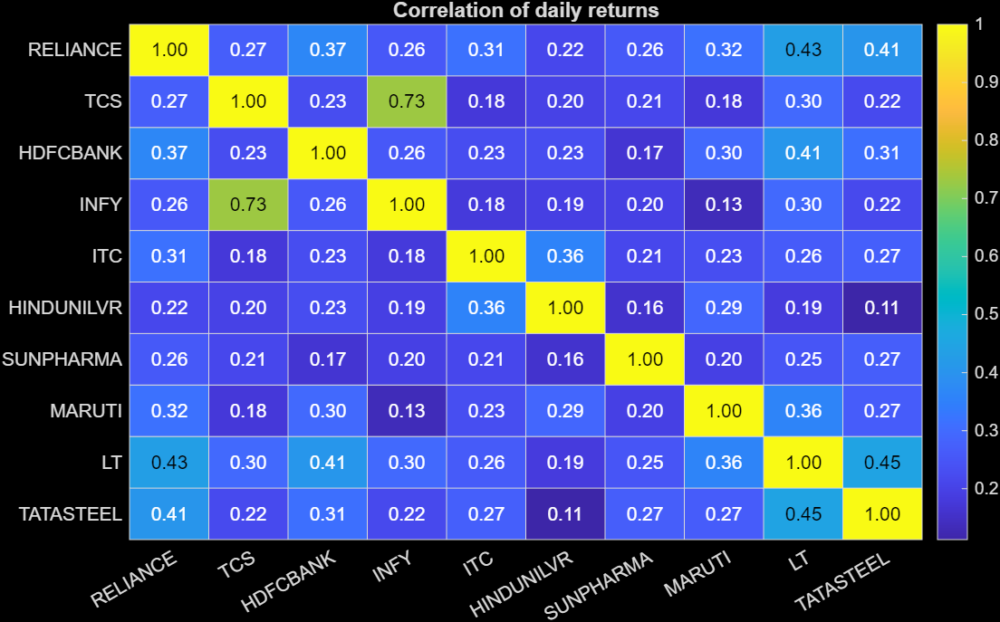
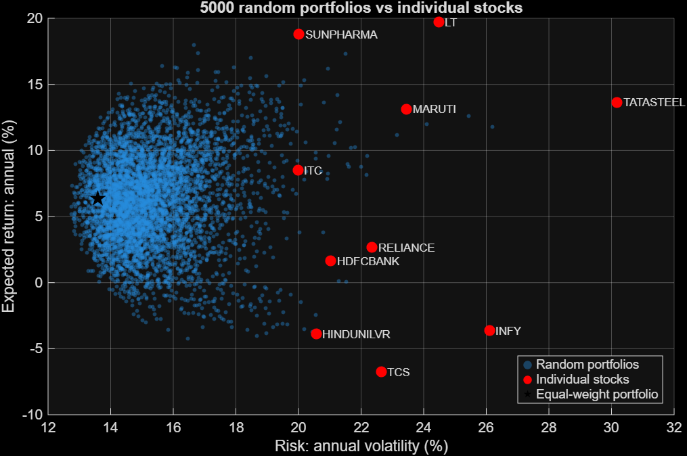
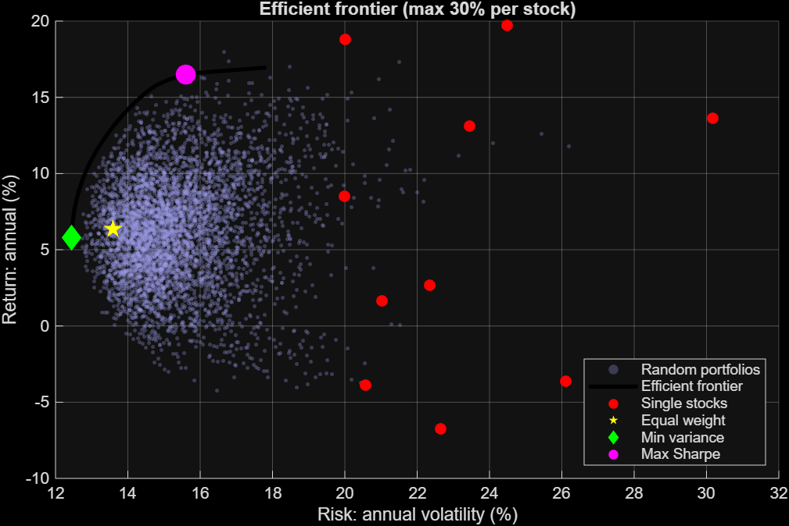
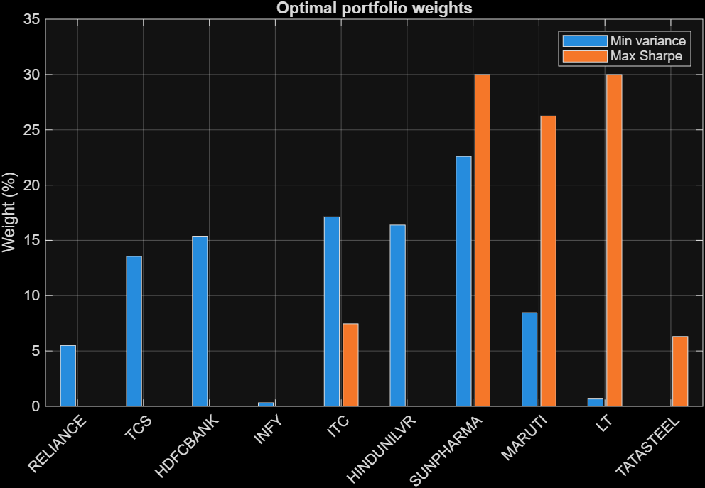
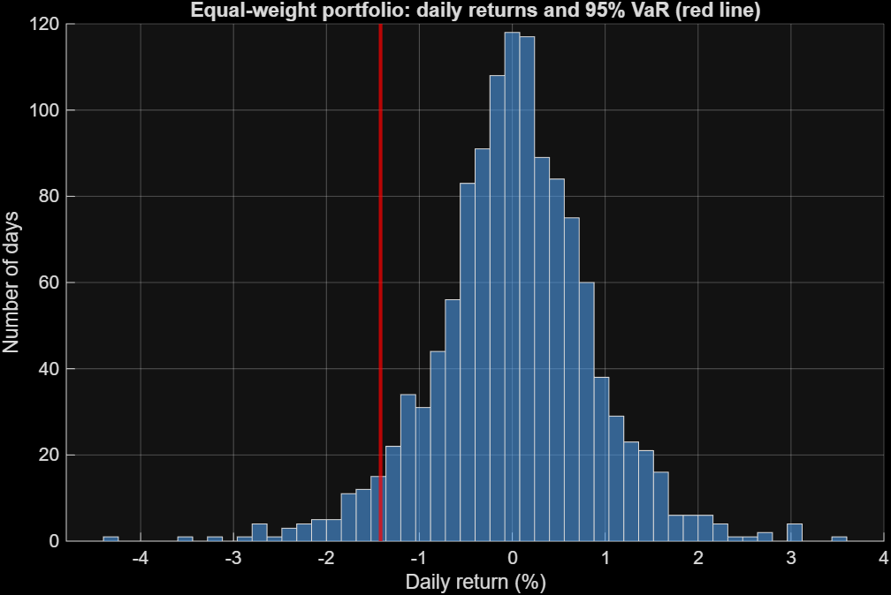
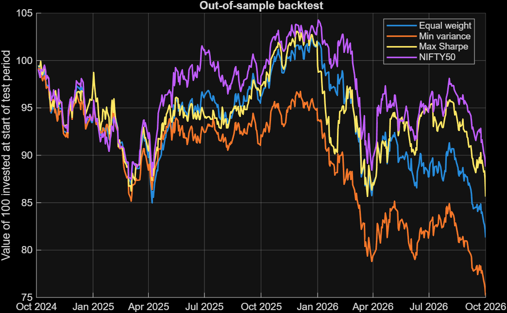

# Portfolio Optimization and Risk Analysis of 10 NIFTY 50 Stocks

A MATLAB project that applies Markowitz mean-variance theory to ten large Indian stocks. It measures diversification, computes the efficient frontier, quantifies downside risk with Value at Risk (VaR) and CVaR, and tests whether the optimized portfolios hold up out of sample.

**Full write-up:** [`report/Portfolio_Optimization_Report.pdf`](report/Portfolio_Optimization_Report.pdf)

## Key findings

| Question | Result |
|---|---|
| Does diversification reduce risk? | Yes. An equal-weight portfolio had **13.6%** annual volatility vs **23.1%** for the average single stock (a 9.5 percentage-point reduction). |
| Can optimization find a better portfolio? | In-sample, yes. The max-Sharpe portfolio had a Sharpe ratio of **0.60** (16.5% return, 15.6% volatility) vs negative Sharpe ratios for equal weight and the NIFTY 50. |
| Does it hold up on unseen data? | **No.** Fitted on the first 3 years and tested on the next 2, the max-Sharpe portfolio's Sharpe ratio fell from **1.53 to -1.02**. |
| Why? | The optimizer put the 30% maximum in ITC because of its 32.5% training return. ITC then lost 27.6% a year. Expected returns are noisy estimates, and optimization amplifies that noise. |

## Figures

| | |
|---|---|
|  |  |
| Correlation of daily returns | 5,000 random portfolios vs single stocks |
|  |  |
| Efficient frontier (30% cap per stock) | Min-variance and max-Sharpe weights |
|  |  |
| Daily returns and 95% VaR | Out-of-sample backtest |

## Method summary

- **Data:** daily adjusted close prices, 4 Oct 2021 to 1 Oct 2026 (1,234 daily returns), for 10 NIFTY 50 stocks from 8 sectors and the NIFTY 50 index, downloaded from Yahoo Finance.
- **Stocks:** Reliance, TCS, HDFC Bank, Infosys, ITC, Hindustan Unilever, Sun Pharma, Maruti Suzuki, L&T, Tata Steel.
- **Annualization:** 252 trading days. Returns x 252, volatility x sqrt(252).
- **Optimization:** MATLAB Financial Toolbox `Portfolio` object. No short selling, weights sum to 100%, maximum 30% per stock.
- **Risk-free rate:** 7.2% (10-year Indian government bond yield, early October 2026).
- **Risk measures:** historical and parametric VaR (95%), historical VaR (99%), CVaR, maximum drawdown.
- **Backtest:** weights fitted on the first 740 trading days, held fixed on the last 494.

## How to run

**Requirements:** MATLAB R2025b (earlier versions likely work) with the Financial Toolbox and an internet connection for the data download.

1. Set MATLAB's **Current Folder** to the `code` folder.
2. Run the scripts in this order:

| Order | Script | What it does |
|---|---|---|
| 1 | `get_data.m` | Downloads prices from Yahoo Finance and saves `prices.mat` |
| 2 | `analyze_returns.m` | Daily returns, volatility, correlation heatmap |
| 3 | `portfolio_basics.m` | Equal-weight portfolio and 5,000 random portfolios |
| 4 | `efficient_frontier.m` | Efficient frontier, min-variance and max-Sharpe portfolios |
| 5 | `var_analysis.m` | VaR and CVaR |
| 6 | `backtest.m` | Out-of-sample test (train 60% / test 40%) |
| 7 | `train_vs_test.m` | Per-stock training vs test returns |

The `.mat` files are created by the scripts and are not stored in this repository.

## Notes and limitations

- Data come from an unofficial Yahoo Finance endpoint. It may change or rate-limit requests, and re-downloading later may give slightly different numbers because of data revisions. The report uses data downloaded in early October 2026.
- One train/test split over about 2 years is suggestive, not conclusive.
- The ten stocks are today's large companies (survivorship and hindsight bias).
- No transaction costs, taxes or rebalancing. Weights are held constant.
- The `^NSEI` series is likely a price index (no dividends), while the stock series are dividend-adjusted.

## Possible extensions

Rolling-window re-optimization, shrinkage estimators for covariance and expected returns, the Black-Litterman model, adding bonds or gold, and transaction-cost constraints.

## Author

Saaj Mulik
